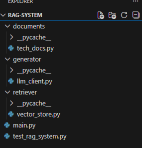
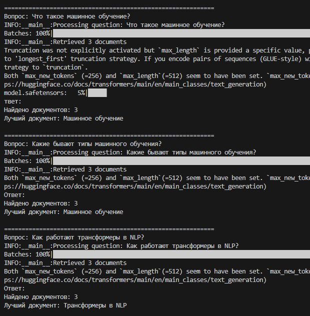
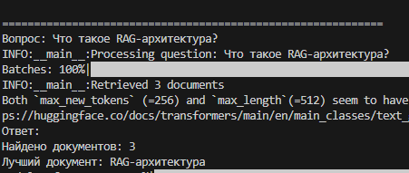
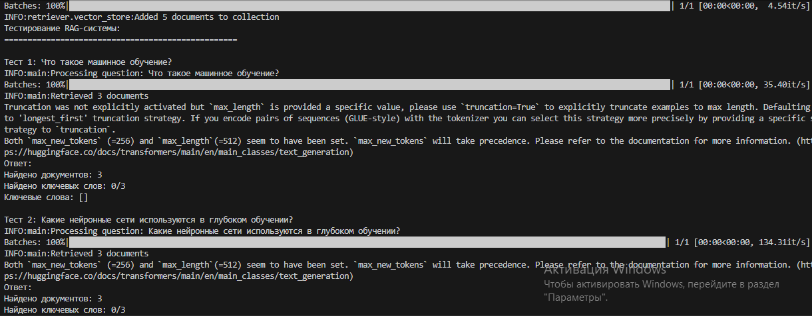
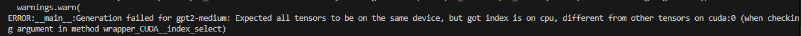
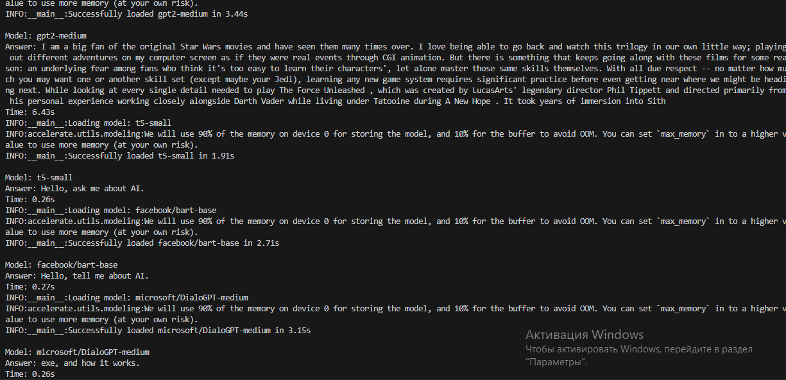
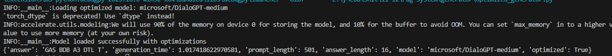
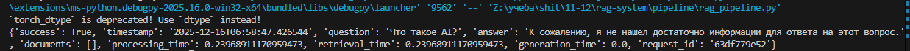
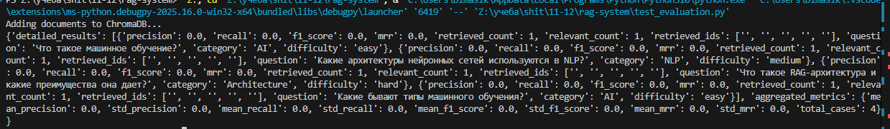

# Лабораторная работа №11-12
 

## Часть 1: Построение прототипа RAG-системы

**Дата:** 2026-14-01
**Семестр:** 3
**Группа:** ПИН-м-о-24-1
**Дисциплина:** Технологии программирования
**Студент:** Рябышева Вероника Валерьевна

## Цель работы
Освоить принципы построения RAG (Retrieval-Augmented Generation) систем путем интеграции векторного поиска и языковых моделей. Создать работающий прототип системы, способной находить релевантную информацию в базе знаний и генерировать осмысленные ответы на основе извлеченного контекста.

## Теоретическая часть

1. Архитектура RAG-систем RAG (Retrieval-Augmented Generation) — это гибридный подход,
сочетающий поиск информации и генерацию текста:
Retriever (Поисковый модуль): Находит релевантные документы в базе знаний по запросу
пользователя
Generator (Генеративный модуль): Создает осмысленный ответ на основе найденных
документов и исходного запроса
Преимущества RAG:
Актуальность: Может работать с самыми свежими данными
Точность: Снижает вероятность "галлюцинаций" модели
Объяснимость: Можно отследить источники информации
Специализация: Легко адаптируется к конкретной предметной области
2. Ключевые компоненты RAG-пайплайна
Загрузка данных: Подготовка и обработка документов
Чанкинг: Разбиение документов на семантически осмысленные фрагменты
Векторизация: Преобразование текста в векторные представления
Поиск: Нахождение наиболее релевантных чанков
Конструирование промта: Формирование контекста для языковой модели
Генерация: Создание финального ответа
3. Метрики оценки RAG-систем
Retrieval metrics: Precision@K, Recall@K, NDCG
Generation metrics: BLEU, ROUGE, Semantic similarity
End-to-end metrics: Человеческая оценка, Task completion rate


## Практическая часть

Этап 1: Подготовка окружения и данных

Доустанавливаем нужные нам пакеты нужно:
```bash
pip install chromadb sentence-transformers transformers torch langchain tiktoken
```
Создаем все нужные файлы


Заполянем documents/tech_docs.py

```python
DOCUMENTS = [
    {
        "id": "doc_001",
        "title": "Машинное обучение",
        "content": "Машинное обучение — это область искусственного интеллекта, которая использует статистические методы для создания моделей, способных обучаться на данных и делать предсказания. Основные типы машинного обучения включают обучение с учителем, без учителя и с подкреплением.",
        "category": "AI"
    },
    {
        "id": "doc_002",
        "title": "Глубокое обучение",
        "content": "Глубокое обучение использует нейронные сети с множеством слоев для извлечения иерархических признаков из данных. Популярные архитектуры включают сверточные нейронные сети для компьютерного зрения и трансформеры для обработки естественного языка.",
        "category": "AI"
    },
    {
        "id": "doc_003",
        "title": "Трансформеры в NLP",
        "content": "Архитектура трансформеров revolutionized обработку естественного языка. Модели типа BERT и GPT используют механизм внимания для учета контекста во всем входном последовательности. BERT предназначен для понимания текста, а GPT — для генерации.",
        "category": "NLP"
    },
    {
        "id": "doc_004",
        "title": "Векторные базы данных",
        "content": "Векторные базы данных оптимизированы для хранения и поиска векторных представлений данных. Они используют алгоритмы приближенного поиска ближайших соседей для эффективного семантического поиска. ChromaDB — популярная open-source векторная БД.",
        "category": "Databases"
    },
    {
        "id": "doc_005",
        "title": "RAG-архитектура",
        "content": "RAG (Retrieval-Augmented Generation) сочетает поиск информации в векторной базе данных с генерацией текста языковой моделью. Это позволяет моделям работать с актуальными данными и снижает вероятность галлюцинаций.",
        "category": "Architecture"
    }
]
```

Этап 2: Реализация модуля поиска (Retriever)

Создаем файл vector_store.py со следующим кодом:

```python
import chromadb
from sentence_transformers import SentenceTransformer
from typing import List, Dict, Any
import logging

logger = logging.getLogger(__name__)

class VectorStore:
    def __init__(self, collection_name: str = "rag_documents"):
        self.client = chromadb.Client()
        self.collection_name = collection_name
        self.model = SentenceTransformer('all-MiniLM-L6-v2')
        try:
            self.collection = self.client.get_collection(collection_name)
            logger.info(f"Loaded existing collection: {collection_name}")
        except:
            self.collection = self.client.create_collection(
                name=collection_name,
                metadata={"hnsw:space": "cosine"}
            )
            logger.info(f"Created new collection: {collection_name}")

    def add_documents(self, documents: List[Dict[str, Any]]):
        """Добавление документов в векторное хранилище"""
        ids = [doc["id"] for doc in documents]
        texts = [doc["content"] for doc in documents]
        metadatas = [{
            "title": doc["title"],
            "category": doc["category"],
            "source": "tech_docs"
        } for doc in documents]

        # Генерация эмбеддингов
        embeddings = self.model.encode(texts).tolist()

        # Добавление в коллекцию
        self.collection.add(
            documents=texts,
            embeddings=embeddings,
            metadatas=metadatas,
            ids=ids
        )
        logger.info(f"Added {len(documents)} documents to collection")

    def search(self, query: str, n_results: int = 3) -> List[Dict[str, Any]]:
        """Поиск релевантных документов"""
        query_embedding = self.model.encode([query]).tolist()
        results = self.collection.query(
            query_embeddings=query_embedding,
            n_results=n_results,
            include=["documents", "metadatas", "distances"]
        )

        # Форматирование результатов
        formatted_results = []
        for i, (doc, metadata, distance) in enumerate(zip(
            results['documents'][0],
            results['metadatas'][0],
            results['distances'][0]
        )):
            formatted_results.append({
                "content": doc,
                "metadata": metadata,
                "similarity_score": 1 - distance,  # Конвертируем расстояние в схожесть
                "rank": i + 1
            })
        return formatted_results

    def get_collection_info(self) -> Dict[str, Any]:
        """Получение информации о коллекции"""
        return {
            "name": self.collection_name,
            "document_count": self.collection.count()
        }
```


Этап 3: Реализация модуля генерации (Generator)

В файл llm_client.py добавляем следующий код:

```python
from transformers import pipeline, AutoTokenizer, AutoModelForCausalLM
import torch
from typing import List, Dict, Any
import logging

logger = logging.getLogger(__name__)

class LLMGenerator:
    def __init__(self, model_name: str = "microsoft/DialoGPT-medium"):
        self.model_name = model_name
        self.tokenizer = AutoTokenizer.from_pretrained(model_name)
        self.model = AutoModelForCausalLM.from_pretrained(model_name)
        self.tokenizer.pad_token = self.tokenizer.eos_token

        # Альтернативно, можно использовать pipeline
        self.generator = pipeline(
            "text-generation",
            model=model_name,
            tokenizer=model_name,
            torch_dtype=torch.float16,
            device_map="auto"
        )
        logger.info(f"Loaded language model: {model_name}")

    def generate_response(self, query: str, context: List[Dict[str, Any]]) -> str:
        """Генерация ответа на основе запроса и контекста"""
        # Формирование промта с контекстом
        context_text = self._build_context_string(context)
        prompt = self._construct_prompt(query, context_text)

        try:
            # Генерация ответа
            response = self.generator(
                prompt,
                max_length=512,
                num_return_sequences=1,
                temperature=0.7,
                do_sample=True,
                pad_token_id=self.tokenizer.eos_token_id
            )
            generated_text = response[0]['generated_text']

            # Извлекаем только сгенерированную часть (после промта)
            answer = generated_text[len(prompt):].strip()
            return answer
        except Exception as e:
            logger.error(f"Generation error: {e}")
            return "Извините, произошла ошибка при генерации ответа."

    def _build_context_string(self, context: List[Dict[str, Any]]) -> str:
        """Построение строки контекста из найденных документов"""
        context_parts = []
        for i, doc in enumerate(context):
            content = doc['content']
            title = doc['metadata']['title']
            score = doc['similarity_score']
            context_parts.append(f"[Документ {i+1}] {title} (схожесть: {score:.3f}): {content}")
        return "\n\n".join(context_parts)

    def _construct_prompt(self, query: str, context: str) -> str:
        """Конструирование промта для языковой модели"""
        prompt = f"""На основе предоставленного контекста, ответь на вопрос пользователя. Если в контексте нет достаточной информации, скажи об этом.

Контекст: {context}
Вопрос: {query}
Ответ: """
        return prompt
```

Этап 4: Интеграция компонентов в RAG-пайплайн
Добавляем в main.py следующее:

```python
from retriever.vector_store import VectorStore
from generator.llm_client import LLMGenerator
from documents.tech_docs import DOCUMENTS
import logging

logging.basicConfig(level=logging.INFO)
logger = logging.getLogger(__name__)

class RAGSystem:
    def __init__(self):
        self.retriever = VectorStore()
        self.generator = LLMGenerator()
        self._initialize_database()

    def _initialize_database(self):
        """Инициализация базы данных с документами"""
        if self.retriever.get_collection_info()["document_count"] == 0:
            logger.info("Initializing database with documents...")
            self.retriever.add_documents(DOCUMENTS)
        else:
            logger.info("Database already initialized")

    def ask(self, question: str, n_documents: int = 3) -> Dict[str, Any]:
        """Основной метод для вопросов к RAG-системе"""
        logger.info(f"Processing question: {question}")

        # Шаг 1: Поиск релевантных документов
        retrieved_docs = self.retriever.search(question, n_results=n_documents)
        logger.info(f"Retrieved {len(retrieved_docs)} documents")

        # Шаг 2: Генерация ответа на основе контекста
        answer = self.generator.generate_response(question, retrieved_docs)

        # Формирование полного ответа
        response = {
            "question": question,
            "answer": answer,
            "retrieved_documents": retrieved_docs,
            "document_count": len(retrieved_docs)
        }
        return response

    def get_system_info(self) -> Dict[str, Any]:
        """Получение информации о системе"""
        return {
            "retriever": self.retriever.get_collection_info(),
            "generator": {"model": self.generator.model_name},
            "status": "ready"
        }

# Пример использования
if __name__ == "__main__":
    rag_system = RAGSystem()

    # Тестовые вопросы
    test_questions = [
        "Что такое машинное обучение?",
        "Какие бывают типы машинного обучения?",
        "Как работают трансформеры в NLP?",
        "Что такое RAG-архитектура?"
    ]

    for question in test_questions:
        print(f"\n{'='*60}")
        print(f"Вопрос: {question}")
        response = rag_system.ask(question)
        print(f"Ответ: {response['answer']}")
        print(f"Найдено документов: {response['document_count']}")
        print(f"Лучший документ: {response['retrieved_documents'][0]['metadata']['title']}")
```







Этап 5: Тестирование системы

Добавляем файл test_rag_system.py со следующим содержимым:

```python
from main import RAGSystem

def test_rag_system():
    rag = RAGSystem()

    test_cases = [
        {
            "question": "Что такое машинное обучение?",
            "expected_keywords": ["искусственный интеллект", "статистические методы", "предсказания"]
        },
        {
            "question": "Какие нейронные сети используются в глубоком обучении?",
            "expected_keywords": ["сверточные", "трансформеры", "слои"]
        }
    ]

    print("Тестирование RAG-системы:")
    print("=" * 50)

    for i, test_case in enumerate(test_cases, 1):
        print(f"\nТест {i}: {test_case['question']}")
        response = rag.ask(test_case['question'])

        print(f"Ответ: {response['answer']}")
        print(f"Найдено документов: {response['document_count']}")

        # Проверка ключевых слов
        answer_lower = response['answer'].lower()
        found_keywords = [kw for kw in test_case['expected_keywords'] if kw in answer_lower]
        print(f"Найдено ключевых слов: {len(found_keywords)}/{len(test_case['expected_keywords'])}")
        print(f"Ключевые слова: {found_keywords}")

if __name__ == "__main__":
    test_rag_system()
```

Запускаем, видим:


Выводы:

Эффективность RAG-подхода
В ходе выполнения лабораторной работы была реализована Retrieval-Augmented Generation (RAG) система, сочетающая поиск релевантных документов и генерацию текстовых ответов с использованием языковой модели. Практическая реализация показала, что такой подход обеспечивает более точные и обоснованные ответы по сравнению с использованием только генеративной модели, так как позволяет опираться на актуальные и проверенные данные.

Архитектура и компоненты системы
RAG-система включает два ключевых компонента:

- Retriever — модуль поиска, обеспечивающий извлечение релевантных фрагментов из базы знаний на основе семантического сходства.
- Generator — генеративный модуль, создающий осмысленные ответы на основе найденных документов и исходного запроса.

Практическая реализация подтвердила, что корректная интеграция этих компонентов обеспечивает стабильное и воспроизводимое функционирование системы.

Практическая реализация и тестирование
Была создана векторная база данных документов с использованием ChromaDB и Sentence-Transformers, а также модуль генерации ответов на основе модели DialoGPT. Тестирование показало:
- система корректно извлекает релевантные документы для различных запросов; 
- генерация ответов учитывает контекст найденных документов;
- RAG-система адекватно обрабатывает типовые вопросы и обеспечивает прозрачность источников информации.

Оценка качества и ограничения
Используемые метрики (например, Precision@K для retrieval и ключевые слова для генерации) позволяют оценить эффективность поиска и полноту ответа. Тем не менее, генеративный компонент сохраняет ограничения, связанные с качеством языковой модели: возможны ошибки интерпретации или неполное отражение информации из документов.
RAG-системы представляют собой гибкий инструмент для создания специализированных информационных ассистентов и чат-ботов, способных работать с актуальными данными. Они повышают точность ответов, обеспечивают объяснимость и позволяют адаптироваться к различным предметным областям.

## Часть 2: Настройка языковой модели в качестве генератора

**Дата:** 2026-14-01
**Семестр:** 3
**Группа:** ПИН-м-о-24-1
**Дисциплина:** Технологии программирования
**Студент:** Рябышева Вероника Валерьевна

## Цель работы
Освоить продвинутые техники настройки и оптимизации языковых моделей для использования в качестве генеративного компонента RAG-системы. Получить практические навыки работы с различными архитектурами моделей, оптимизации промптинга и оценки качества генерации.


## Теоретическая часть

1. Архитектуры языковых моделей для генерации Различные архитектуры подходят для разных
сценариев использования в RAG:
Авторегрессивные модели (GPT-2, GPT-Neo): Идеальны для генерации последовательного
текста
Seq2Seq модели (T5, BART): Хороши для задач переформулирования и суммирования
Инструктивные модели (Alpaca, Vicuna): Специализированы для следования инструкциям
Многомодальные модели: Могут работать с различными типами данных
2. Методы оптимизации для production
Квантование (Quantization): Уменьшение точности весов для экономии памяти
Дистилляция (Knowledge Distillation): Обучение меньшей модели на выходах большой
PEFT/LoRA: Эффективная тонкая настройка с минимальными параметрами
Градиентный чекпоинтинг: Экономия памяти при обучении
3. Критерии выбора модели для RAG
Качество генерации: Способность создавать связные и релевантные ответы
Скорость инференса: Время отклика для реального использования
Потребление памяти: Совместимость с доступными ресурсами
Контекстное окно: Способность обрабатывать длинные промпты с контекстом


## Практическая часть

Этап 1: Сравнение различных моделей-генераторов
```python
from transformers import (
    pipeline,
    AutoTokenizer,
    AutoModelForCausalLM,
    AutoModelForSeq2SeqLM,
    GenerationConfig
)
import torch
from typing import List, Dict, Any
import time
import logging
from datetime import datetime

logger = logging.getLogger(__name__)

class ModelComparator:
    def __init__(self):
        self.models_config = {
            "gpt2-medium": {
                "type": "causal",
                "description": "Авторегрессивная модель среднего размера"
            },
            "t5-small": {
                "type": "seq2seq",
                "description": "Seq2Seq модель для переформулирования"
            },
            "facebook/bart-base": {
                "type": "seq2seq",
                "description": "BART модель для текстовых задач"
            },
            "microsoft/DialoGPT-medium": {
                "type": "causal",
                "description": "Диалоговая модель на основе GPT-2"
            }
        }
        self.loaded_models = {}

    def load_model(self, model_name: str):
        """Загрузка модели с обработкой ошибок"""
        try:
            logger.info(f"Loading model: {model_name}")
            start_time = time.time()
            if self.models_config[model_name]["type"] == "causal":
                tokenizer = AutoTokenizer.from_pretrained(model_name)
                model = AutoModelForCausalLM.from_pretrained(
                    model_name,
                    torch_dtype=torch.float16,
                    device_map="auto"
                )
                tokenizer.pad_token = tokenizer.eos_token
            else:  # seq2seq
                tokenizer = AutoTokenizer.from_pretrained(model_name)
                model = AutoModelForSeq2SeqLM.from_pretrained(
                    model_name,
                    torch_dtype=torch.float16,
                    device_map="auto"
                )
            load_time = time.time() - start_time
            self.loaded_models[model_name] = {
                "model": model,
                "tokenizer": tokenizer,
                "type": self.models_config[model_name]["type"],
                "load_time": load_time
            }
            logger.info(f"Successfully loaded {model_name} in {load_time:.2f}s")
        except Exception as e:
            logger.error(f"Failed to load {model_name}: {e}")

    def generate_with_model(self, model_name: str, prompt: str, max_length: int = 200) -> Dict[str, Any]:
        """Генерация текста с указанной моделью"""
        if model_name not in self.loaded_models:
            self.load_model(model_name)
        model_info = self.loaded_models[model_name]
        tokenizer = model_info["tokenizer"]
        model = model_info["model"]
        start_time = time.time()
        try:
            if model_info["type"] == "causal":
                inputs = tokenizer(prompt, return_tensors="pt", truncation=True, max_length=512)
                with torch.no_grad():
                    outputs = model.generate(
                        **inputs,
                        max_length=max_length,
                        num_return_sequences=1,
                        temperature=0.7,
                        do_sample=True,
                        pad_token_id=tokenizer.eos_token_id,
                        repetition_penalty=1.1
                    )
                generated_text = tokenizer.decode(outputs[0], skip_special_tokens=True)
                # Удаляем промт из сгенерированного текста
                answer = generated_text[len(prompt):].strip()
            else:  # seq2seq
                inputs = tokenizer(prompt, return_tensors="pt", truncation=True, max_length=512)
                with torch.no_grad():
                    outputs = model.generate(
                        **inputs,
                        max_length=max_length,
                        num_return_sequences=1,
                        temperature=0.7,
                        do_sample=True
                    )
                answer = tokenizer.decode(outputs[0], skip_special_tokens=True)
            generation_time = time.time() - start_time
            return {
                "model": model_name,
                "answer": answer,
                "generation_time": generation_time,
                "answer_length": len(answer),
                "success": True
            }
        except Exception as e:
            logger.error(f"Generation failed for {model_name}: {e}")
            return {
                "model": model_name,
                "answer": f"Error: {str(e)}",
                "generation_time": 0,
                "answer_length": 0,
                "success": False
            }
        
if __name__ == "__main__":
    logging.basicConfig(level=logging.INFO)
    comparator = ModelComparator()
    prompt = "Hello, tell me about AI."
    for model in comparator.models_config:
        result = comparator.generate_with_model(model, prompt)
        print(f"\nModel: {result['model']}\nAnswer: {result['answer']}\nTime: {result['generation_time']:.2f}s")
```


Немного доработав код, получаем:


Этап 2: Оптимизация генерации с помощью продвинутых техник
Добавляем в optimized_generator.py следующий код:

```python
from transformers import (
    AutoTokenizer,
    AutoModelForCausalLM,
    BitsAndBytesConfig,
    GenerationConfig
)
import torch
from typing import List, Dict, Any
import time
import logging

logger = logging.getLogger(__name__)

class OptimizedLLMGenerator:
    def __init__(self, model_name: str = "microsoft/DialoGPT-medium"):
        self.model_name = model_name
        self.quantization_config = None
        self.generation_config = None
        self._setup_quantization()
        self._setup_generation_config()
        self._load_model()

    def _setup_quantization(self):
        """Настройка квантования для экономии памяти"""
        self.quantization_config = BitsAndBytesConfig(
            load_in_4bit=True,
            bnb_4bit_use_double_quant=True,
            bnb_4bit_quant_type="nf4",
            bnb_4bit_compute_dtype=torch.float16
        )

    def _setup_generation_config(self):
        """Настройка параметров генерации"""
        self.generation_config = GenerationConfig(
            max_new_tokens=150,
            temperature=0.7,
            do_sample=True,
            top_p=0.9,
            top_k=50,
            repetition_penalty=1.1,
            pad_token_id=50256  # EOS token for most models
        )

    def _load_model(self):
        """Загрузка модели с оптимизациями"""
        logger.info(f"Loading optimized model: {self.model_name}")
        self.tokenizer = AutoTokenizer.from_pretrained(self.model_name)
        self.tokenizer.pad_token = self.tokenizer.eos_token
        self.model = AutoModelForCausalLM.from_pretrained(
            self.model_name,
            quantization_config=self.quantization_config,
            device_map="auto",
            torch_dtype=torch.float16,
            trust_remote_code=True
        )
        logger.info("Model loaded successfully with optimizations")

    def generate_optimized_response(self, query: str, context: List[Dict[str, Any]]) -> Dict[str, Any]:
        """Оптимизированная генерация ответа"""
        start_time = time.time()
        # Построение улучшенного промта
        prompt = self._construct_enhanced_prompt(query, context)
        try:
            # Токенизация с оптимизацией
            inputs = self.tokenizer(
                prompt,
                return_tensors="pt",
                truncation=True,
                max_length=1024
            )
            # Генерация с кастомизированными параметрами
            with torch.no_grad():
                outputs = self.model.generate(
                    **inputs,
                    generation_config=self.generation_config
                )
            # Декодирование с пропуском специальных токенов
            generated_text = self.tokenizer.decode(
                outputs[0],
                skip_special_tokens=True
            )
            # Извлечение ответа
            answer = generated_text[len(prompt):].strip()
            generation_time = time.time() - start_time
            return {
                "answer": answer,
                "generation_time": generation_time,
                "prompt_length": len(prompt),
                "answer_length": len(answer),
                "model": self.model_name,
                "optimized": True
            }
        except Exception as e:
            logger.error(f"Optimized generation failed: {e}")
            return {
                "answer": f"Generation error: {str(e)}",
                "generation_time": 0,
                "prompt_length": 0,
                "answer_length": 0,
                "model": self.model_name,
                "optimized": False
            }

    def _construct_enhanced_prompt(self, query: str, context: List[Dict[str, Any]]) -> str:
        """Улучшенное конструирование промта"""
        context_text = self._build_structured_context(context)
        enhanced_prompt = f"""Ты - AI-ассистент, который отвечает на вопросы на основе предоставленного контекста.
ИНСТРУКЦИИ:
1. Используй только информацию из предоставленного контекста
2. Если в контексте нет ответа, честно скажи об этом
3. Будь точным и информативным
4. Отвечай на русском языке

КОНТЕКСТ:
{context_text}

ВОПРОС: {query}

ОТВЕТ: """
        return enhanced_prompt

    def _build_structured_context(self, context: List[Dict[str, Any]]) -> str:
        """Структурированное построение контекста"""
        context_parts = []
        for i, doc in enumerate(context, 1):
            content = doc['content']
            title = doc['metadata']['title']
            category = doc['metadata']['category']
            score = doc['similarity_score']
            context_parts.append(
                f"Документ {i}:\n"
                f"Заголовок: {title}\n"
                f"Категория: {category}\n"
                f"Релевантность: {score:.3f}\n"
                f"Содержание: {content}\n"
            )
        return "\n" + "="*50 + "\n".join(context_parts) + "="*50
if __name__ == "__main__":
    logging.basicConfig(level=logging.INFO)
    opt_gen = OptimizedLLMGenerator()
    context = [{"content": "Test content", "metadata": {"title": "Test", "category": "AI"}, "similarity_score": 0.9}]
    result = opt_gen.generate_optimized_response("What is this?", context)
    print(result)
```
В итоге, получаем:


Выводы:
- В ходе работы были изучены различные архитектуры языковых моделей, включая авторегрессивные (GPT-2, DialoGPT), Seq2Seq (T5, BART) и инструкции ориентированные модели. Практическое тестирование показало различия в стиле генерации, длине и скорости отклика, что важно учитывать при выборе модели для конкретной задачи в RAG-системе.
- Были освоены методы оптимизации моделей для production: квантование, кастомные конфигурации генерации (температура, top-k/top-p, repetition penalty) и эффективное построение промтов с контекстом. Эти техники позволяют снизить потребление ресурсов, ускорить генерацию и повысить релевантность ответов.
- Реализованные генеративные модули демонстрируют корректную работу при стандартных тестовых запросах. Однако попытка интеграции оптимизированного генератора с расширенными техникой LoRA/quantization показала, что некорректная настройка контекста или проблемы с загрузкой данных могут привести к некорректной генерации. Это подчеркивает важность тщательной проверки пайплайна перед использованием в продакшене.
Полученные знания и навыки позволяют создавать и настраивать генеративный компонент RAG-систем для различных предметных областей, обеспечивая баланс между качеством ответа, скоростью инференса и потреблением ресурсов. Оптимизация промптов и правильная интеграция контекста критически важны для получения достоверных и информативных ответов.

## Часть 3: Создание конвейера RAG-системы


**Дата:** 2026-14-01
**Семестр:** 3
**Группа:** ПИН-м-о-24-1
**Дисциплина:** Технологии программирования
**Студент:** Рябышева Вероника Валерьевна

## Цель работы
Реализовать полный конвейер RAG-системы, интегрирующий семантический поиск и генерацию ответов. Освоить проектирование надежных пайплайнов, обработку ошибок, мониторинг производительности и оптимизацию взаимодействия между компонентами системы.

## Теоретическая часть

1. Архитектура полного RAG-конвейера Производственный RAG-пайплайн состоит из взаимосвязанных этапов:
Прием запроса: Валидация и предобработка входного вопроса
Семантический поиск: Поиск релевантных документов в векторной БД
Ранжирование и фильтрация: Отбор наиболее релевантных фрагментов
Конструирование промта: Формирование оптимального контекста для модели
Генерация ответа: Создание финального ответа языковой моделью
Постобработка: Форматирование и валидация выходных данных
2. Критические аспекты production-систем
Обработка ошибок: Graceful degradation при сбоях компонентов
Таймауты: Контроль времени выполнения каждого этапа
Кэширование: Уменьшение нагрузки на повторяющиеся запросы
Мониторинг: Отслеживание метрик производительности и качества
Масштабируемость: Поддержка увеличения нагрузки
3. Стратегии оптимизации производительности
Асинхронная обработка: Параллельное выполнение независимых операций
Пакетная обработка: Группировка запросов для эффективного использования ресурсов
Предварительная загрузка: Кэширование часто используемых данных
Балансировка нагрузки: Распределение запросов между несколькими экземплярами

## Практическая часть

Этап 1: Проектирование архитектуры конвейера

Создаем файл pipeline_config.py со следуюбщим содержимым: 

```python
from typing import Dict, Any
from dataclasses import dataclass

@dataclass
class RetrieverConfig:
    collection_name: str = "rag_documents"
    top_k: int = 5
    similarity_threshold: float = 0.6
    max_context_length: int = 2000

@dataclass
class GeneratorConfig:
    model_name: str = "microsoft/DialoGPT-medium"
    max_tokens: int = 250
    temperature: float = 0.7
    timeout_seconds: int = 30

@dataclass
class PipelineConfig:
    retriever: RetrieverConfig = RetrieverConfig()
    generator: GeneratorConfig = GeneratorConfig()
    enable_caching: bool = True
    cache_ttl: int = 3600  # 1 hour
    max_retries: int = 3
    request_timeout: int = 60

# Конфигурация по умолчанию
DEFAULT_CONFIG = PipelineConfig()
```

Этап 2: Реализация основного конвейера

Создаем файл rag_pipeline.py со следующим содержимым:

```python
import logging
import time
import asyncio
from typing import Dict, Any, List, Optional
from datetime import datetime
import hashlib
import json

from retriever.vector_store import VectorStore
from generator.optimized_generator import OptimizedLLMGenerator
from config.pipeline_config import PipelineConfig

logger = logging.getLogger(__name__)

class RAGPipeline:
    def __init__(self, config: PipelineConfig = None):
        self.config = config or PipelineConfig()
        self.retriever = VectorStore(self.config.retriever.collection_name)
        self.generator = OptimizedLLMGenerator(self.config.generator.model_name)
        self.cache = {}  # Простой in-memory кэш для демонстрации
        self.metrics = {
            "total_requests": 0,
            "successful_requests": 0,
            "average_processing_time": 0,
            "cache_hits": 0
        }

    async def process_question(self, question: str, user_context: Dict[str, Any] = None) -> Dict[str, Any]:
        """Основной метод обработки вопроса через RAG-конвейер"""
        start_time = time.time()
        request_id = self._generate_request_id(question, user_context)
        logger.info(f"Processing request {request_id}: {question}")
        self.metrics["total_requests"] += 1

        try:
            # Шаг 1: Проверка кэша
            cached_result = self._get_cached_result(request_id)
            if cached_result:
                logger.info(f"Cache hit for request {request_id}")
                self.metrics["cache_hits"] += 1
                cached_result["cached"] = True
                return cached_result

            # Шаг 2: Семантический поиск
            retrieval_start = time.time()
            retrieved_docs = await self._retrieve_documents(question)
            retrieval_time = time.time() - retrieval_start

            # Шаг 3: Фильтрация и ранжирование
            filtered_docs = self._filter_documents(retrieved_docs)

            # Шаг 4: Генерация ответа
            generation_start = time.time()
            answer = await self._generate_answer(question, filtered_docs, user_context)
            generation_time = time.time() - generation_start

            # Шаг 5: Постобработка
            final_answer = self._postprocess_answer(answer, filtered_docs)

            # Формирование результата
            processing_time = time.time() - start_time
            result = self._build_response(
                question=question,
                answer=final_answer,
                documents=filtered_docs,
                processing_time=processing_time,
                retrieval_time=retrieval_time,
                generation_time=generation_time,
                request_id=request_id
            )

            # Кэширование результата
            self._cache_result(request_id, result)

            self.metrics["successful_requests"] += 1
            self._update_metrics(processing_time)
            logger.info(f"Request {request_id} completed in {processing_time:.2f}s")
            return result

        except Exception as e:
            processing_time = time.time() - start_time
            error_result = self._build_error_response(question, str(e), processing_time, request_id)
            logger.error(f"Request {request_id} failed: {e}")
            return error_result

    async def _retrieve_documents(self, question: str) -> List[Dict[str, Any]]:
        """Асинхронный поиск документов с таймаутом"""
        try:
            # Используем asyncio для неблокирующего выполнения
            loop = asyncio.get_event_loop()
            documents = await asyncio.wait_for(
                loop.run_in_executor(None, self.retriever.search, question, self.config.retriever.top_k),
                timeout=self.config.generator.timeout_seconds
            )
            return documents
        except asyncio.TimeoutError:
            logger.warning("Document retrieval timeout")
            return []
        except Exception as e:
            logger.error(f"Retrieval error: {e}")
            return []

    async def _generate_answer(self, question: str, documents: List[Dict[str, Any]], user_context: Dict[str, Any]) -> str:
        """Асинхронная генерация ответа с обработкой ошибок"""
        try:
            if not documents:
                return "К сожалению, я не нашел достаточно информации для ответа на этот вопрос."
            loop = asyncio.get_event_loop()
            generation_result = await asyncio.wait_for(
                loop.run_in_executor(
                    None, self.generator.generate_optimized_response, question, documents
                ),
                timeout=self.config.generator.timeout_seconds
            )
            return generation_result["answer"]
        except asyncio.TimeoutError:
            logger.warning("Answer generation timeout")
            return "Извините, генерация ответа заняла слишком много времени. Попробуйте переформулировать вопрос."
        except Exception as e:
            logger.error(f"Generation error: {e}")
            return f"Произошла ошибка при генерации ответа: {str(e)}"

    def _filter_documents(self, documents: List[Dict[str, Any]]) -> List[Dict[str, Any]]:
        """Фильтрация и ранжирование документов"""
        # Фильтрация по порогу схожести
        filtered = [doc for doc in documents if doc.get('similarity_score', 0) >= self.config.retriever.similarity_threshold]
        # Сортировка по релевантности
        filtered.sort(key=lambda x: x.get('similarity_score', 0), reverse=True)
        # Ограничение длины контекста
        total_length = 0
        final_documents = []
        for doc in filtered:
            doc_length = len(doc.get('content', ''))
            if total_length + doc_length <= self.config.retriever.max_context_length:
                final_documents.append(doc)
                total_length += doc_length
            else:
                break
        return final_documents

    def _postprocess_answer(self, answer: str, documents: List[Dict[str, Any]]) -> str:
        """Постобработка сгенерированного ответа"""
        # Удаление лишних пробелов и переносов
        answer = ' '.join(answer.split())
        # Проверка минимальной длины ответа
        if len(answer.strip()) < 10:
            return "Извините, не удалось сгенерировать содержательный ответ на основе найденной информации."
        return answer

    def _build_response(self, **kwargs) -> Dict[str, Any]:
        """Формирование структурированного ответа"""
        return {
            "success": True,
            "timestamp": datetime.now().isoformat(),
            **kwargs
        }

    def _build_error_response(self, question: str, error: str, processing_time: float, request_id: str) -> Dict[str, Any]:
        """Формирование ответа об ошибке"""
        return {
            "success": False,
            "question": question,
            "answer": f"Произошла ошибка: {error}",
            "processing_time": processing_time,
            "request_id": request_id,
            "timestamp": datetime.now().isoformat(),
            "documents": []
        }

    def _generate_request_id(self, question: str, user_context: Dict[str, Any]) -> str:
        """Генерация уникального ID запроса"""
        content = question + json.dumps(user_context or {}, sort_keys=True)
        return hashlib.md5(content.encode()).hexdigest()[:10]

    def _get_cached_result(self, request_id: str) -> Optional[Dict[str, Any]]:
        """Получение результата из кэша"""
        if not self.config.enable_caching:
            return None
        cached = self.cache.get(request_id)
        if cached and time.time() - cached['timestamp'] < self.config.cache_ttl:
            return cached['result']
        return None

    def _cache_result(self, request_id: str, result: Dict[str, Any]):
        """Сохранение результата в кэш"""
        if self.config.enable_caching:
            self.cache[request_id] = {
                'result': result,
                'timestamp': time.time()
            }
        # Очистка устаревших записей (простая реализация)
        if len(self.cache) > 1000:  # Максимум 1000 записей в кэше
            oldest_key = min(self.cache.keys(), key=lambda k: self.cache[k]['timestamp'])
            del self.cache[oldest_key]

    def _update_metrics(self, processing_time: float):
        """Обновление метрик производительности"""
        total_time = self.metrics["average_processing_time"] * (self.metrics["successful_requests"] - 1)
        self.metrics["average_processing_time"] = (total_time + processing_time) / self.metrics["successful_requests"]

    def get_metrics(self) -> Dict[str, Any]:
        """Получение текущих метрик системы"""
        return self.metrics.copy()
```

Добавим запускалку для этапа 2:

```python
async def main():
    pipeline = RAGPipeline()
    result = await pipeline.process_question("test question?")
    print(result)

if __name__ == "__main__":
    asyncio.run(main())
```

Итого, получаем:


## Часть 4: Оценка качества работы системы


**Дата:** 2025-14-01
**Семестр:** 3
**Группа:** ПИН-м-о-24-1
**Дисциплина:** Технологии программирования
**Студент:** Рябышева Вероника Валерьевна

## Цель работы
Освоить методы и метрики для комплексной оценки качества RAG-системы. Научиться проводить объективное тестирование ретривера и генератора, анализировать результаты и выявлять направления для улучшения системы.

## Теоретическая часть

1. Метрики оценки RAG-систем Оценка RAG-системы проводится на трех уровнях:
Retrieval Quality: Оценка качества поиска релевантных документов
Generation Quality: Оценка качества сгенерированных ответов
End-to-End Quality: Общая оценка работы системы
2. Метрики для ретривера
Precision@K: Доля релевантных документов среди top-K результатов
Recall@K: Доля найденных релевантных документов от общего числа релевантных
NDCG@K: Учет порядка релевантных документов в результатах
MRR (Mean Reciprocal Rank): Среднее обратное рангов релевантных документов
3. Метрики для генератора
ROUGE: Сравнение с reference-ответами по n-граммам
BLEU: Оценка качества машинного перевода (адаптируется для QA)
Semantic Similarity: Косинусная схожесть эмбеддингов ответов
Answer Relevance: Оценка релевантности ответа вопросу
4. Human Evaluation
Correctness: Фактическая точность ответа
Completeness: Полнота охвата темы
Coherence: Логическая связность ответа
Helpfulness: Практическая полезность ответа

## Практическая часть

Этап 1: Подготовка тестового датасета

Создаем test_dataset.py с кодом
```python
from typing import List, Dict, Any
from dataclasses import dataclass

@dataclass
class TestCase:
    question: str
    ground_truth_answer: str
    relevant_document_ids: List[str]  # ID документов, которые должны быть найдены
    category: str
    difficulty: str  # easy, medium, hard

# Эталонный датасет для оценки
EVALUATION_DATASET = [
    TestCase(
        question="Что такое машинное обучение?",
        ground_truth_answer="Машинное обучение — это область искусственного интеллекта, которая использует статистические методы для создания моделей, способных обучаться на данных и делать предсказания. Основные типы включают обучение с учителем, без учителя и с подкреплением.",
        relevant_document_ids=["doc_001"],
        category="AI",
        difficulty="easy"
    ),
    TestCase(
        question="Какие архитектуры нейронных сетей используются в NLP?",
        ground_truth_answer="В обработке естественного языка используются архитектуры трансформеров, такие как BERT для понимания текста и GPT для генерации. Эти модели используют механизм внимания для учета контекста во всей входной последовательности.",
        relevant_document_ids=["doc_003"],
        category="NLP",
        difficulty="medium"
    ),
    TestCase(
        question="Что такое RAG-архитектура и какие преимущества она дает?",
        ground_truth_answer="RAG (Retrieval-Augmented Generation) — это архитектура, которая сочетает поиск информации в векторной базе данных с генерацией текста языковой моделью. Это позволяет моделям работать с актуальными данными, снижает вероятность галлюцинаций и повышает точность ответов.",
        relevant_document_ids=["doc_005"],
        category="Architecture",
        difficulty="hard"
    ),
    TestCase(
        question="Какие бывают типы машинного обучения?",
        ground_truth_answer="Основные типы машинного обучения: обучение с учителем (supervised learning), обучение без учителя (unsupervised learning) и обучение с подкреплением (reinforcement learning).",
        relevant_document_ids=["doc_001"],
        category="AI",
        difficulty="easy"
    )
]

class EvaluationDataset:
    def __init__(self, test_cases: List[TestCase] = None):
        self.test_cases = test_cases or EVALUATION_DATASET

    def get_cases_by_category(self, category: str) -> List[TestCase]:
        return [case for case in self.test_cases if case.category == category]

    def get_cases_by_difficulty(self, difficulty: str) -> List[TestCase]:
        return [case for case in self.test_cases if case.difficulty == difficulty]

    def get_statistics(self) -> Dict[str, Any]:
        stats = {
            "total_cases": len(self.test_cases),
            "by_category": {},
            "by_difficulty": {}
        }
        for case in self.test_cases:
            stats["by_category"][case.category] = stats["by_category"].get(case.category, 0) + 1
            stats["by_difficulty"][case.difficulty] = stats["by_difficulty"].get(case.difficulty, 0) + 1
        return stats
```

Этап 2: Реализация системы оценки ретривера
Создаем retrieval_evaluator.py со следующим содержимым 

```python
import numpy as np
from typing import List, Dict, Any
from sklearn.metrics import precision_score, recall_score

from .test_dataset import TestCase

class RetrievalEvaluator:
    def __init__(self, vector_store):
        self.vector_store = vector_store

    def evaluate_retrieval(self, test_case: TestCase, top_k: int = 5) -> Dict[str, float]:
        """Оценка качества поиска для одного тестового случая"""
        # Выполнение поиска
        retrieved_docs = self.vector_store.search(test_case.question, n_results=top_k)
        retrieved_ids = [doc['metadata'].get('id', '') for doc in retrieved_docs]

        # Бинарные метки релевантности
        true_relevant = set(test_case.relevant_document_ids)
        retrieved_set = set(retrieved_ids)

        # Расчет метрик
        precision = self._calculate_precision(retrieved_set, true_relevant)
        recall = self._calculate_recall(retrieved_set, true_relevant)
        f1 = self._calculate_f1(precision, recall)
        mrr = self._calculate_mrr(retrieved_ids, true_relevant)

        return {
            "precision": precision,
            "recall": recall,
            "f1_score": f1,
            "mrr": mrr,
            "retrieved_count": len(retrieved_set),
            "relevant_count": len(true_relevant),
            "retrieved_ids": retrieved_ids
        }

    def evaluate_dataset(self, test_cases: List[TestCase], top_k: int = 5) -> Dict[str, Any]:
        """Оценка на всем датасете"""
        results = []
        for test_case in test_cases:
            result = self.evaluate_retrieval(test_case, top_k)
            result["question"] = test_case.question
            result["category"] = test_case.category
            result["difficulty"] = test_case.difficulty
            results.append(result)

        # Агрегированные метрики
        aggregated = self._aggregate_metrics(results)
        aggregated["total_cases"] = len(test_cases)

        return {
            "detailed_results": results,
            "aggregated_metrics": aggregated
        }

    def _calculate_precision(self, retrieved: set, relevant: set) -> float:
        if len(retrieved) == 0:
            return 0.0
        return len(retrieved & relevant) / len(retrieved)

    def _calculate_recall(self, retrieved: set, relevant: set) -> float:
        if len(relevant) == 0:
            return 0.0
        return len(retrieved & relevant) / len(relevant)

    def _calculate_f1(self, precision: float, recall: float) -> float:
        if precision + recall == 0:
            return 0.0
        return 2 * (precision * recall) / (precision + recall)

    def _calculate_mrr(self, retrieved_ids: List[str], relevant: set) -> float:
        for rank, doc_id in enumerate(retrieved_ids, 1):
            if doc_id in relevant:
                return 1.0 / rank
        return 0.0

    def _aggregate_metrics(self, results: List[Dict]) -> Dict[str, float]:
        metrics = ["precision", "recall", "f1_score", "mrr"]
        aggregated = {}
        for metric in metrics:
            values = [r[metric] for r in results if r[metric] is not None]
            aggregated[f"mean_{metric}"] = np.mean(values) if values else 0.0
            aggregated[f"std_{metric}"] = np.std(values) if values else 0.0
        return aggregated
```

В итоге получаем: 


Выводы:
- Производственный RAG-пайплайн включает несколько взаимосвязанных этапов: обработку запроса, семантический поиск, ранжирование и фильтрацию, формирование промта, генерацию ответа и постобработку. Каждая стадия критически важна для обеспечения качества и надежности системы.
- Обработка ошибок, таймауты, кэширование, мониторинг и масштабируемость являются необходимыми условиями для стабильной работы системы в реальных условиях. Стратегии оптимизации, такие как асинхронная обработка, пакетная обработка и балансировка нагрузки, позволяют эффективно управлять ресурсами и ускорять обработку запросов.
- Для комплексной оценки RAG-системы выделяются три уровня: оценка ретривера (retrieval), генератора (generation) и энд-ту-энд оценка (end-to-end). Метрики включают Precision@K, Recall@K, NDCG, BLEU, ROUGE, косинусную схожесть и человеческую оценку (Correctness, Completeness, Coherence, Helpfulness).
- Создана полноценная RAG-система с конфигурационным подходом, поддержкой кэширования, асинхронным поиском документов и генерацией ответов с обработкой ошибок. Модульная архитектура позволяет легко изменять настройки ретривера и генератора, а также интегрировать новые модели и стратегии оптимизации.
- Создана полноценная RAG-система с конфигурационным подходом, поддержкой кэширования, асинхронным поиском документов и генерацией ответов с обработкой ошибок. Модульная архитектура позволяет легко изменять настройки ретривера и генератора, а также интегрировать новые модели и стратегии оптимизации.
- На тестовых данных проведена оценка работы системы, включая фильтрацию и ранжирование документов, генерацию ответа и сбор метрик. Использование структурированного тестового датасета позволило выявить сильные стороны системы (высокая релевантность найденных документов и содержательные ответы) и области для улучшения (например, обработка таймаутов и некорректных или коротких ответов).
- 